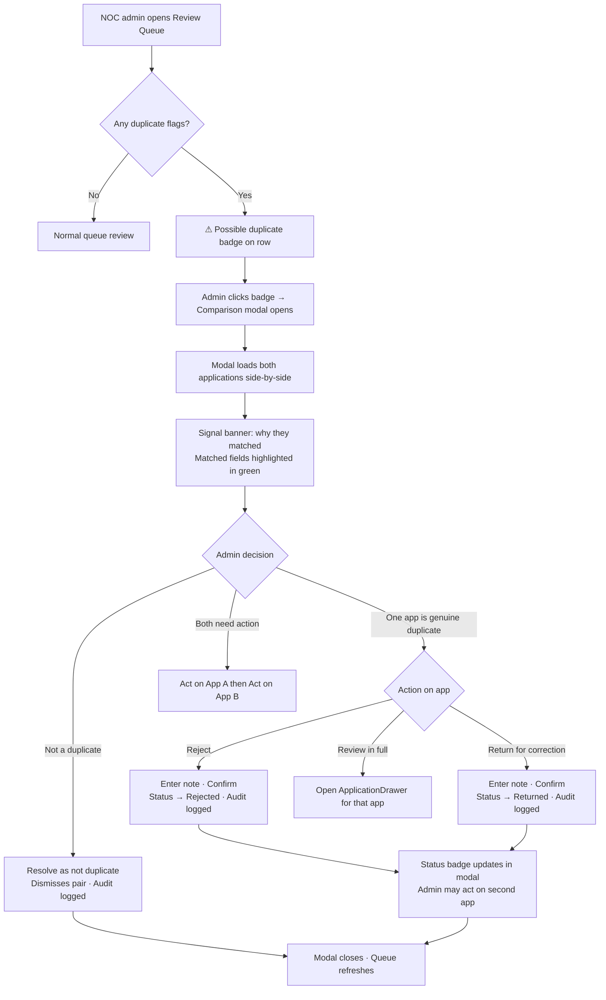

# Duplicate Detection & NOC Review Workflow

## Problem Frame

The current duplicate detection flags applications whose organisations share the same email domain within a NOC. This is a useful first signal but misses several common cases: the same contact person applying under two differently-named outlets, regional branches of the same company using different email domains but the same website, and near-identical organisation names (e.g. "Reuters" vs "Reuters Limited"). NOC admins also have limited resolution options — they can only dismiss a flag or navigate away to review each application individually. They cannot reject or return an application directly from the comparison view.

## Current Matching Logic (as-built)

Detection runs server-side on every NOC queue page load (`src/lib/anomaly-detect.ts`). The rule is:

> Two organisations are flagged as duplicates when they share the same `email_domain` value and both have applications under the same NOC for the same event.

- Email domain is extracted from the contact email at submission time and stored on the `organizations` table.
- Matching is exact string equality; no fuzzy comparison.
- Dismissed pairs are stored in `dismissed_duplicate_pairs` and excluded from future detection.
- Detection is scoped to a single NOC; cross-NOC duplicates are surfaced separately in the IOC dashboard via `isMultiTerritoryFlag`.

The comparison modal (`src/app/admin/noc/queue/DuplicateCompareModal.tsx`) currently highlights rows where field values *differ*, which is the inverse of useful: it shows what is different, not why the flag was raised.

## Requirements

**Matching Signals**

- R1. Retain same-email-domain matching (exact, within NOC) as a High signal.
- R2. Add same-contact-email matching (exact, case-insensitive, within NOC) as a High signal.
- R3. Add same-website-hostname matching (within NOC) as a Medium signal. Hostname comparison strips the `www.` prefix; the rest of the hostname is compared exactly (e.g. `reuters.co.uk` matches `reuters.co.uk` but not `reuters.com.au`).
- R4. Add normalised-org-name + same-country matching (within NOC) as a Medium signal. Normalisation: lowercase, strip common legal suffixes (Ltd, Limited, Inc, Corp, Corporation, LLC, GmbH, Pty, PLC, BV, NV, SA, AG), strip punctuation, collapse whitespace. Both the normalised name AND country must match for this signal to fire.
- R5. Any single signal firing is sufficient to flag the pair for review.
- R6. Each detected pair records which signals fired; this is used for UI highlighting and future audit capability.
- R7. Dismissed pairs continue to suppress re-flagging regardless of how many signals fire.

**UI — Comparison Modal**

- R8. The comparison table highlights rows whose field corresponds to a fired signal (i.e. the matched fields, not the differing fields). Highlighted rows use a green-tinted background to indicate "this is why they matched."
- R9. A banner above the table lists the fired signals in plain English (e.g. "Flagged: same email domain · same website domain").
- R10. A "Website" row is added to the comparison table (currently absent).
- R11. Signal-to-field mapping:

  | Signal | Highlighted field label |
  |---|---|
  | `email_domain` | Email domain |
  | `contact_email` | Contact email |
  | `website_domain` | Website |
  | `org_name` | Org name |

**NOC Review Actions**

- R12. A NOC admin can **reject** either application directly from the comparison modal, without navigating away. A required note must be provided.
- R13. A NOC admin can **return for correction** either application directly from the comparison modal. A required note must be provided.
- R14. Both actions trigger the same status transitions and audit log entries as the equivalent actions taken from the application review drawer.
- R15. After a reject or return action, the modal remains open (so the admin can also act on the second application if needed), and the comparison table reflects the updated status.
- R16. The existing "Resolve as not duplicate" action (dismisses the pair without affecting application status) is retained.
- R17. All actions taken from the modal are audit-logged with `actor_type: noc_admin`.

## User Flow

## Success Criteria

- NOC admins can identify why two applications were flagged without reading every field.
- Common duplicate patterns (same contact, same website, similar org name) are detected before reaching the approval stage.
- NOC admins can fully resolve a duplicate flag — reject, return, or dismiss — without leaving the comparison view.

## Scope Boundaries

- No ML or embedding-based similarity; normalised string comparison only.
- Website hostname comparison does not use a public suffix list; `www.`-stripping is the only normalisation applied to the host.
- Cross-NOC contact-email detection (same person applying under different NOCs) is out of scope for this iteration; surfaced separately in the IOC dashboard.
- No merge or consolidation of applications; they remain separate entities.
- Dismissed pairs cannot currently be un-dismissed via the UI (direct DB operation required).
- Fuzzy org name matching uses normalisation only (no Levenshtein or phonetic algorithms).

## Key Decisions

- **Any single signal flags the pair** — rather than requiring a minimum score, simplicity and auditability are preferred; NOC admins review all flags manually.
- **Green highlight for matched fields** — green communicates "this is the evidence of a match," distinguishing it from yellow/warning semantics used elsewhere in the UI.
- **Inline actions do not navigate away** — the modal stays open after a reject or return so admins can act on both applications in one session.
- **Website hostname (not apex domain)** — avoids the complexity of a public suffix list while still catching the most common case of identical hostnames.
- **Org name + country must both match** — org name alone produces too many false positives (e.g. "Reuters" appears in many NOCs legitimately).

## Outstanding Questions

### Deferred to Planning

- [Affects R3][Needs research] Does the `organizations.website` field reliably contain a full URL, or can it contain bare hostnames or partial URLs? Normalisation logic should handle both.
- [Affects R15][Technical] After an inline reject/return, should the status badge in the comparison table update optimistically (client-side state) or re-fetch from the server?
