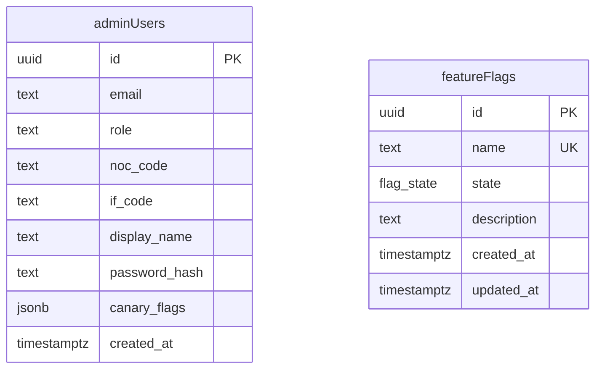

# feat: Feature Flag / Canary Rollout System

## Overview

A lightweight, two-tier feature flag system that lets D.TEC deploy new features to a controlled subset of admin users before releasing to everyone — with no extra deployment required to graduate a feature once it passes canary testing.

**Two-tier model:**
- **Global flag state** (`off | canary | on`) — stored in DB, checked live on every request. Flipping to `on` takes effect immediately for all users.
- **Per-user canary membership** — stored in the `adminUsers` row, baked into the session cookie at login. Controls who sees a feature when global state is `canary`.

---

## Problem Statement

Every change currently ships to all 206 NOC admins simultaneously. There is no way to test a significant workflow change (new PbN UI, updated approval flow, email notifications) with a small group of trusted NOCs before opening it to everyone. A broken deploy affects all users at once.

---

## Proposed Solution

### Data model

**New table: `featureFlags`**

```sql
CREATE TYPE flag_state AS ENUM ('off', 'canary', 'on');

CREATE TABLE IF NOT EXISTS feature_flags (
  id          uuid PRIMARY KEY DEFAULT gen_random_uuid(),
  name        text NOT NULL UNIQUE,           -- e.g. "new_pbn_ui"
  state       flag_state NOT NULL DEFAULT 'off',
  description text NOT NULL DEFAULT '',
  created_at  timestamptz NOT NULL DEFAULT now(),
  updated_at  timestamptz NOT NULL DEFAULT now()
);
```

**New column: `adminUsers.canaryFlags`**

```sql
ALTER TABLE admin_users
  ADD COLUMN IF NOT EXISTS canary_flags jsonb;
-- stores string[] of flag names; null = no canary memberships
```

### Session change

Add `canaryFlags: string[]` to `SessionPayload` (`src/lib/session.ts`).

Populated at login from `adminUsers.canaryFlags` — baked into the signed cookie. Per-user membership only refreshes on next login (deliberate — safer than live re-reads).

### Flag check helper (`src/lib/feature-flags.ts`)

```typescript
import { cache } from "react";
import { db } from "@/db";
import { featureFlags } from "@/db/schema";
import type { SessionPayload } from "@/lib/session";

// Memoised per request — all hasFlag calls in one request share one DB query
const getGlobalFlagStates = cache(async (): Promise<Record<string, "off" | "canary" | "on">> => {
  const rows = await db.select({ name: featureFlags.name, state: featureFlags.state }).from(featureFlags);
  return Object.fromEntries(rows.map((r) => [r.name, r.state]));
});

export async function hasFlag(session: SessionPayload, flagName: string): Promise<boolean> {
  const states = await getGlobalFlagStates();
  const state = states[flagName];
  if (!state || state === "off") return false;
  if (state === "on") return true;
  // canary — check per-user membership from session
  return session.canaryFlags?.includes(flagName) ?? false;
}
```

**Usage in a server component or action:**

```typescript
// src/app/admin/noc/pbn/page.tsx
const session = await requireNocSession();
if (await hasFlag(session, "new_pbn_ui")) {
  return <NewPbnLayout />;
}
return <PbnLayout />;
```

### DTEC admin UI (`/admin/ioc/flags`)

Protected by `requireIocAdminSession()`. Accessible only to D.TEC (IOC admin role).

**Flag list view:**
- Table: flag name, description, state badge, enrolled user count, created date
- Action: create new flag (name + description; state starts `off`)
- Action: delete flag (only if state is `off`)

**Flag detail view (`/admin/ioc/flags/[name]`):**
- State toggle: `off → canary → on` (and reverse) with confirmation step
- Enrolled users: table of users currently in canary for this flag
- Add to canary: by email address OR by NOC code (adds all users in that NOC)
- Remove from canary: individual users

All writes go through `requireWritable()` to respect sudo read-only invariant. Each state change and enrollment change is written to the audit log.

---

## Technical Approach

### Implementation Phases

#### Phase 1: Schema + session (foundation)

- Generate migration `0013_feature_flags` via `bun db:generate`:
  - `flag_state` enum
  - `feature_flags` table
  - `canary_flags jsonb` column on `admin_users`
- Add `canaryFlags: string[]` to `SessionPayload` type in `src/lib/session.ts`
- Update `src/app/admin/login/actions.ts`: read `user.canaryFlags` (or `[]` if null) and include in `setSession()` call
- Create `src/lib/feature-flags.ts` with `hasFlag()` and `getGlobalFlagStates()`

#### Phase 2: Admin UI

- Create `src/app/admin/ioc/flags/page.tsx` — flag list
- Create `src/app/admin/ioc/flags/[name]/page.tsx` — flag detail + enrolment management
- Create `src/app/admin/ioc/flags/actions.ts` — `createFlag`, `deleteFlag`, `setFlagState`, `enrollUser`, `enrollNoc`, `unenrollUser`
- Add `"Flags"` to `src/app/admin/ioc/nav.tsx`
- Add `"feature_flag_state_changed"` and `"feature_flag_enrollment_changed"` to `auditActionEnum` in schema

#### Phase 3: Developer guide

- Write `docs/feature-flags.md` — lifecycle guide with real-life example (see below)

---

## Flag lifecycle

```
[Deploy A] Ship feature behind flag (state: off)
     │
     ▼
DTEC sets state → canary
DTEC enrolls 2-3 trusted NOC admins
     │
     ▼
Canary users test. Issues found → return to DTEC → fix → redeploy
     │  No issues → expand canary if needed
     ▼
DTEC sets state → on   ← NO DEPLOY. Immediate for all users.
     │
     ▼
[Deploy B] Developer removes old code + hasFlag check + flag row deleted
```

**Key rule:** Never set all users to the flag. Instead flip global state to `on`. Old code cleanup happens in the next natural deploy — not a dedicated release.

**Max active flags:** 2–3 at any time. When a flag moves to `on`, the cleanup task is created immediately.

---

## Alternative Approaches Considered

| Approach | Why rejected |
|---|---|
| LaunchDarkly / GrowthBook | External service overkill for 206 users; cost; adds an external dependency to a portal with no external integrations yet |
| Environment variable flags | Cannot be changed without a deploy; DTEC admin can't toggle without engineering involvement |
| Middleware-based URL rewriting | Middleware runs at the edge and can't read the DB; would require cookie-based bucketing which is less controllable |
| Live DB lookup for per-user membership | Correct but adds a DB query per request per flag; session-baking is sufficient since DTEC controls canary enrolment |

---

## System-Wide Impact

### Interaction Graph

1. `hasFlag(session, 'X')` → calls `getGlobalFlagStates()` → single DB query on `feature_flags` (memoised per-request via React `cache()`)
2. Server component receives result → conditionally renders `<NewFeature />` or `<OldFeature />`
3. If `<NewFeature />` calls a server action → same `hasFlag` call in action (if business logic differs); `getGlobalFlagStates` is called again but hits React cache, no second DB query

### Error & Failure Propagation

- If `feature_flags` table is unreachable: `getGlobalFlagStates()` throws → Next.js error boundary catches → user sees error page. **Mitigation:** wrap in try/catch in `getGlobalFlagStates`, return `{}` on failure → all flags treated as `off` (safe default).
- If `canaryFlags` is missing from session (existing sessions pre-migration): `session.canaryFlags?.includes()` with optional chaining returns `false` safely.

### State Lifecycle Risks

- **Canary user loses membership between requests:** if DTEC removes a user from canary while they're logged in, the session still has the old canaryFlags until next login. Acceptable — DTEC can inform the user to re-login if needed.
- **Flag deleted while state is `canary`:** `getGlobalFlagStates()` returns no entry for the flag → `hasFlag` returns `false` → safe fallback to old behaviour.
- **No orphan risk:** The `feature_flags` table has no foreign keys. Deleting a flag row is safe; no cascade needed.

### Backward Compatibility (critical)

Any feature shipped behind a flag MUST follow these rules:

1. **Schema changes are additive only** — new columns nullable or with defaults. Old code ignores new columns; new code handles null old data.
2. **Data written by new path must be readable by old path** — OCOG and IOC cross-NOC views will see data from both flagged and unflagged users simultaneously.
3. **Data written by old path must be readable by new path** — new code handles records created before the flag existed (missing new fields → nulls → graceful handling required).

### API Surface Parity

The IOC sudo feature (`/admin/ioc/sudo`) lets D.TEC impersonate any admin user. Because `hasFlag` reads from the session (which is overridden by the sudo session), D.TEC can verify the experience as a specific canary user by using sudo. No extra work needed.

### Integration Test Scenarios

1. User with `canaryFlags: ["new_pbn_ui"]` and global state `canary` → `hasFlag` returns `true`
2. User with `canaryFlags: ["new_pbn_ui"]` and global state `off` → `hasFlag` returns `false` (global state overrides)
3. User with `canaryFlags: []` and global state `on` → `hasFlag` returns `true` (everyone gets it)
4. Flag name not in `feature_flags` table → `hasFlag` returns `false` (undefined key → safe default)
5. Global state flipped from `canary` to `on` mid-session → next request returns `true` for all users (live DB check)

---

## Acceptance Criteria

### Functional Requirements

- [ ] `hasFlag(session, flagName)` returns `true` only for: enrolled users when state is `canary`, or all users when state is `on`
- [ ] Global state change (e.g. `canary → on`) takes effect on the next request without any deployment or user re-login
- [ ] Per-user canary membership takes effect on user's next login
- [ ] DTEC admin can create, toggle state, and delete flags via `/admin/ioc/flags`
- [ ] DTEC admin can enrol users individually or by NOC code
- [ ] All flag state changes and enrolment changes are recorded in the audit log
- [ ] Deleting a flag is only permitted when state is `off`
- [ ] `hasFlag` returns `false` for unknown flag names (safe default)
- [ ] `hasFlag` returns `false` on DB failure (error swallowed, safe default)

### Non-Functional Requirements

- [ ] Maximum one DB query per request for all flag checks combined (React `cache()` memoisation)
- [ ] Existing sessions (pre-migration) handle missing `canaryFlags` gracefully via optional chaining
- [ ] Audit log entries for flag actions follow existing `actorType / actorId / actorLabel / action` pattern

### Quality Gates

- [ ] Migration generated via `bun db:generate` (not hand-written SQL)
- [ ] `docs/feature-flags.md` written and reviewed

---

## Dependencies & Prerequisites

- None. Fully self-contained. No external services. No changes to existing business logic.

---

## Risk Analysis

| Risk | Likelihood | Mitigation |
|---|---|---|
| DB failure makes `getGlobalFlagStates` throw | Low | Wrap in try/catch, return `{}` — all flags off |
| Developer forgets backward compatibility rule for new flagged feature | Medium | `docs/feature-flags.md` checklist; code review |
| Flag accumulation (dead code) | Medium | Convention: max 3 active flags; cleanup task created on every `→ on` flip |
| Canary user sees inconsistent state mid-session | Very low | Acceptable; re-login resolves it |

---

## ERD



---

## Files to Create / Modify

| File | Change |
|---|---|
| `src/db/schema.ts` | Add `flagStateEnum`, `featureFlags` table, `canaryFlags` column on `adminUsers`, `auditActionEnum` additions |
| `src/db/migrations/0013_feature_flags.sql` | Generated — enum, table, column |
| `src/lib/session.ts` | Add `canaryFlags: string[]` to `SessionPayload` |
| `src/app/admin/login/actions.ts` | Read `user.canaryFlags` and pass to `setSession()` |
| `src/lib/feature-flags.ts` | New — `hasFlag()`, `getGlobalFlagStates()` |
| `src/app/admin/ioc/flags/page.tsx` | New — flag list UI |
| `src/app/admin/ioc/flags/[name]/page.tsx` | New — flag detail + enrolment |
| `src/app/admin/ioc/flags/actions.ts` | New — flag CRUD + enrolment actions |
| `src/app/admin/ioc/nav.tsx` | Add "Flags" nav item |
| `docs/feature-flags.md` | New — developer guide |

---

## Sources & References

- Session implementation: `src/lib/session.ts:17` (SessionPayload type)
- Login action (session creation): `src/app/admin/login/actions.ts:30`
- adminUsers schema: `src/db/schema.ts:223`
- Migration convention: `src/db/migrations/0007_sprint_b1_b3_b4.sql` (ALTER TYPE pattern)
- IOC nav: `src/app/admin/ioc/nav.tsx:6`
- Audit log pattern: `src/db/schema.ts` (auditActionEnum)
