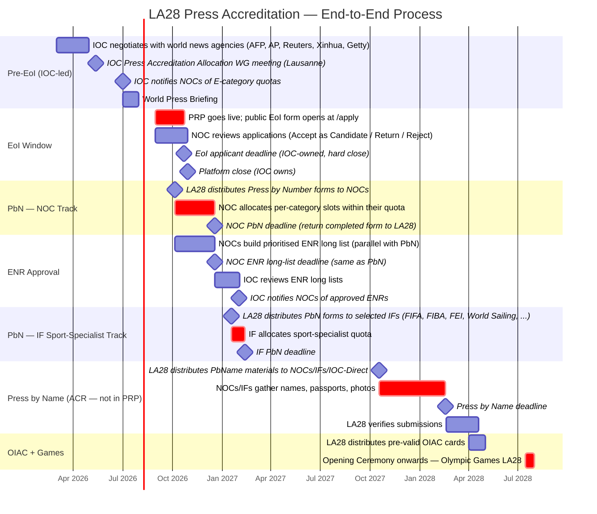

**Created: 26-Apr-2026 19:30 CEST**

# LA28 Press Accreditation — Process Timeline & Critical Periods

Visual reference for the end-to-end LA28 press accreditation process and PRP's role in it. Dates from the IOC Press Accreditation Strategic Plan (Feb 2026 FINAL) plus the 2026-04-24 Emma corrections (EoI window opens 31 August, not 24 August).

This document is intended for stakeholder discussions: to align on which phase we are in at any given time, who owns it, and which dates are hard / soft / TBC. It is also the visual context for `docs/strategic-plan-gap-analysis.md` and `docs/input and feedback/stakeholder-questions-21-April-2026.md`.

---

## Top-level Gantt



---

## Swim-lane responsibility view

Who is doing what during each critical period. Read horizontally for one role's lifecycle, vertically for who is active at a given time.

| Phase / Period | NOC | OCOG (LA28) | IOC | IF (selected) | Applicant / ENR org |
|---|---|---|---|---|---|
| **Mar–Jul 2026 — Pre-EoI** | — (waiting for quotas) | — (preparing systems) | Sets quotas; negotiates with major agencies; issues Press Accreditation Strategic Plan | — (waiting for IOC notification ~Nov 2026) | — |
| **Aug–Oct 2026 — EoI window** | Receives EoI applications, reviews and decides per app (Candidate / Return / Reject); communicates outcomes directly to applicants | **Coordinator** of cross-NOC visibility; flags issues if seen; does NOT approve individual orgs | Read-only oversight; flags compliance issues if seen | — | Submits EoI via `/apply` form on `olympics.com` link, by 23 Oct 2026 |
| **Oct–Dec 2026 — NOC PbN** | Allocates per-category slots within IOC-assigned quota; informs each org of their accreditation; submits PbN form by 18 Dec | Receives NOC submissions; coordinates downstream services (accommodation, rate card, SEAT, ACR); flags anomalies back to NOC | Compliance review of which orgs the NOC accredited; flags anomalies; does NOT adjust slot counts | — (receiving allocation notification from IOC ~Nov 2026) | Receives accreditation decision **directly from their NOC** (no PRP-side batch release) |
| **Oct 2026 – Feb 2027 — ENR** | Builds ENR long-list (parallel with PbN); ranks priorities; submits to IOC by 18 Dec; informs each ENR org of IOC's decision | Coordinator only; IOC and NOC own the decisions; LA28 ingests approved ENRs into ACR | **Decides** which ENRs are granted from the holdback pool; partial / full / denied per org; deadline w/c 1 Feb 2027 | — | If approved, accreditation flows through their NOC (or directly if IOC-Direct ENR like CNN, Al Jazeera, BBC World) |
| **Jan–Feb 2027 — IF PbN** | — (NOC PbN already closed) | Receives IF submissions; same coordinator role as for NOC | Compliance review of IF submissions | **IF is Responsible Organisation** for sport-specialist Es / EPs; allocates quota to specialists not chosen by their NOC | — |
| **Oct 2027 – Feb 2028 — Press by Name (in ACR)** | Collects names, passports, photos from each accredited org; submits via ACR by 18 Feb | Operates ACR; verifies data | Oversight; flags anomalies | Same — collects and submits for sport specialists | Provides their personal data (passport, photo) via the org / NOC |
| **Apr 2028** | Distributes OIAC pre-valid cards to its press orgs | Produces and distributes pre-valid OIAC | Final checks | Distributes to its sport specialists | Receives OIAC card from NOC / IF |
| **14–30 Jul 2028 — Games** | Final escalations, on-the-ground co-ordination | Operates Main Press Centre, accreditation services | Final authority | Sport-specific support | Covers the Games |

---

## Critical-path dates (what cascades if missed)

| Date | Event | Cascade if missed |
|---|---|---|
| **31 Aug 2026** | PRP / EoI window opens | Public can't apply; whole funnel stalls |
| **23 Oct 2026** | EoI applicant deadline | Applicants who miss this can only enter via NOC Direct Entry or NOC Invite |
| **30 Oct 2026** | Platform hard close (IOC-owned) | After this, no new EoI submissions accepted under any path |
| **5 Oct 2026** | LA28 distributes PbN forms to NOCs | NOCs can't start allocating; pushes the 18 Dec PbN deadline at risk |
| **18 Dec 2026** | NOC PbN deadline + ENR long-list deadline | Late submissions are still accepted (per Emma #11), but flagged to IOC and lose the IOC's normal processing window. ENR long lists submitted late are not guaranteed IOC review by 1 Feb 2027 |
| **w/c 1 Feb 2027** | IOC notifies NOCs of approved ENRs | NOCs can't notify their non-MRH orgs; downstream press accommodation booking misses windows |
| **12 Feb 2027** | IF PbN deadline | Sport-specialist allocations risk being absent from ACR's first import |
| **18 Oct 2027** | Press by Name starts | Marks the natural PRP → ACR handoff candidate (per §4.3 re-open) |
| **18 Feb 2028** | Press by Name deadline | Late submissions delay OIAC production; risk no card by Games-time |
| **April 2028** | OIAC card distribution | If late, accredited press can't enter the country (no OIAC = no visa-free entry per Charter Rule 52) |

---

## PRP-internal lifecycle (engineering view)

```mermaid
gantt
    title PRP — Engineering Lifecycle Overlaid on Process Timeline
    dateFormat YYYY-MM-DD
    axisFormat %b %Y

    section v0.x prototype
    Current state — v0.2 prototype (everything before commit 824faee)        :done, 2026-01-01, 2026-04-25
    v0.9 build (technical integrations: SSO, email, ACR, monitoring, etc.)    :active, 2026-04-26, 90d
    v0.9 hardening + v1.0 cut                                                 :2026-07-25, 30d

    section Production
    PRP live in production                                                    :crit, 2026-08-31, 60d
    PRP serving NOC PbN allocation                                            :crit, 2026-10-05, 75d
    PRP → ACR handoff window (resolves at §4.3 re-open meeting)               :2026-12-18, 304d
    PRP read-only / historical (post-PbName-start)                            :2027-10-18, 300d

    section Stakeholder gates
    Stakeholder meeting (re-opens, design decisions)                          :milestone, mtg1, 2026-04-30, 0d
    ACR API contract sign-off                                                 :milestone, mtg2, 2026-04-30, 0d
    ACR integration go/no-go                                                  :milestone, mtg3, 2026-06-01, 0d
    Production deployment + final QA                                          :2026-07-01, 60d
```

---

## How to read this document

- **Critical-path tasks** are highlighted by Mermaid's `crit` modifier (red bar in most renderers). These are the periods where any slippage cascades.
- **Milestones** are shown as diamonds (single-day events). These are non-negotiable dates per the IOC Strategic Plan.
- The **swim-lane table** shows who owns each phase. Per the 2026-04-26 §2 reframe in `stakeholder-questions-21-April-2026.md`, OCOG is a coordinator (not an approver), IOC is a compliance reviewer (not an approver), NOC is the arbiter of slot allocation within their quota.
- The **PRP engineering lifecycle** chart maps internal version milestones onto the process timeline so engineering decisions can be evaluated against process deadlines.

---

## Caveats and open questions

- **Late submissions** (per Emma #11): "many NOCs will not submit their forms" by 18 Dec. The hard-deadline boxes in the Gantt are real for IOC tracking purposes but the system will accept late submissions; they are flagged "late" rather than rejected.
- **PRP → ACR handoff** (§4.3 re-open): the natural cutoff is PbName-start (October 2027), not `sent_to_acr` (Dec 2026 / Jan 2027). Until this is resolved at the next stakeholder meeting, treat the period 18 Dec 2026 → 18 Oct 2027 as "tentatively PRP-master, but ACR may already be operating." See stakeholder-questions §4.3.
- **IF PbN window** assumes the proposed 18 Jan – 12 Feb 2027 range; this is per Strategic Plan §2.6 and pending confirmation in stakeholder-questions §4.6.
- **ENR IOC-direct path** (CNN, Al Jazeera, BBC World) is in PRP at `/admin/ioc/enr/direct` and follows the same dates as the NOC ENR flow but without NOC mediation.
- **All dates revised 2026-04-24 per Emma #65** — EoI opens 31 August, not 24 August.

---

## Conversion to DOCX

This document uses Mermaid Gantt syntax which renders in GitHub, Obsidian, VS Code, and the Proof editor (`proofeditor.ai`). For PowerPoint or other static-image needs, convert via the project's `md-to-docx` skill, or render the Mermaid blocks individually using the Mermaid CLI:

```
npx -y @mermaid-js/mermaid-cli@latest -i docs/process-timeline-2026-04-26.md -o /tmp/timeline.png
```

For stakeholder presentations, recommend rendering each Gantt block as a PNG and embedding in slides; the swim-lane table converts cleanly to DOCX as-is.
